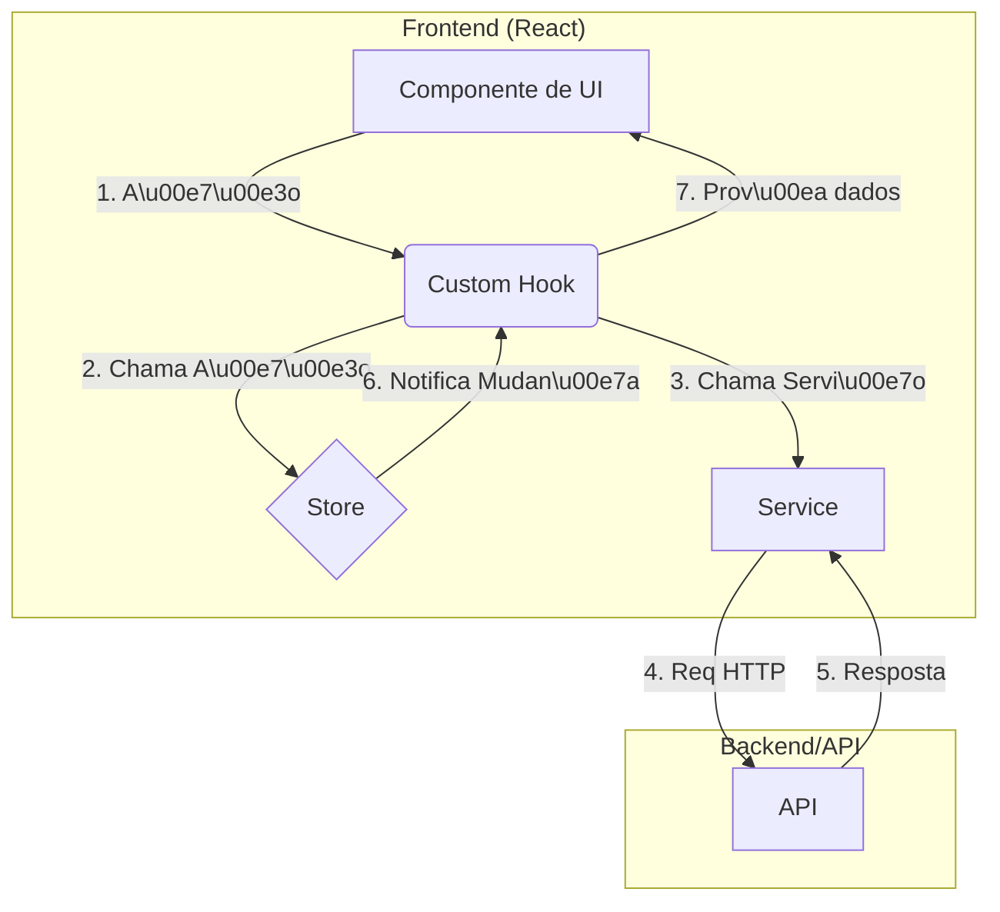

# Plataforma de Agentes - Arquitetura

## Vis\u00e3o Geral
Este documento descreve a organiza\u00e7\u00e3o do c\u00f3digo e as camadas da aplica\u00e7\u00e3o. O objetivo \u00e9 manter uma estrutura modular, previs\u00edvel e f\u00e1cil de manter.

## Stack Tecnol\u00f3gica
- **React** com **Vite**
- **TypeScript**
- **Zustand** para estado global
- **Tailwind CSS** e **shadcn/ui** para a interface
- **Vitest** e **Testing Library** para testes

## Estrutura de Pastas
```
client/src
|-- api/             # Configura\u00e7\u00f5es iniciais e cliente HTTP
|-- components/
|   |-- ui/          # Componentes visuais reutiliz\u00e1veis
|   |-- layouts/     # Componentes de layout principal
|   |-- features/    # Componentes agrupados por funcionalidade
|   |-- agents/      # Funcionalidades espec\u00edficas de agentes
|       |-- config_forms/
|-- hooks/           # L\u00f3gica de UI e efeitos colaterais
|-- services/        # Comunica\u00e7\u00e3o com APIs
|-- store/           # Zustand stores
|-- types/           # Tipagens de dom\u00ednio
|-- pages/           # Entradas de rota
|-- main.tsx         # Ponto de entrada
```

## Fluxo de Dados


## Camadas
1. **UI**: componentes e p\u00e1ginas respons\u00e1veis apenas pela renderiza\u00e7\u00e3o.
2. **Hooks**: l\u00f3gica de UI, interagem com stores e servi\u00e7os.
3. **Stores**: estado global usando Zustand.
4. **Services**: abstra\u00e7\u00e3o de comunica\u00e7\u00e3o com APIs ou mocks.

## Boas Pr\u00e1ticas
- Nunca expor credenciais no front-end; use `.env`.
- Utilizar `React.lazy` e memoiza\u00e7\u00e3o onde fizer sentido.
- Testar servi\u00e7os, hooks e componentes de forma isolada.

## Contratos e Tipos
Todos os tipos de dom\u00ednio residem em `client/src/types`. Exemplos:
```ts
export interface ChatMessage {
  id: string;
  text: string;
  sender: 'user' | 'agent' | 'system';
  timestamp: string;
}

export interface AnyAgentConfig {
  id: string;
  name: string;
  type: string;
}
```

## Architecture Decision Records (ADRs)

Architecture Decision Records (ADRs) are used to document important architectural decisions made during the project's lifecycle. They provide context, rationale, and consequences for these decisions, ensuring clarity and consistency in our architectural approach.

### When to Write an ADR

An ADR should be written for any decision that has a significant impact on the system's architecture, including:

*   Choosing a new technology, framework, or library.
*   Defining a major architectural pattern or approach.
*   Changing an existing architectural decision.
*   Adopting a new standard or convention.

### Using the ADR Template

ADRs should follow the template defined in `docs/adrs/0000-template.md`. The template includes the following sections:

*   **Title:** A concise summary of the decision.
*   **Status:** The current status of the ADR (e.g., Proposed, Accepted, Deprecated, Superseded).
*   **Context:** The background, problem, and constraints that led to the decision.
*   **Decision:** The specific decision made.
*   **Consequences:** The potential positive and negative impacts of the decision.

### ADR Lifecycle

The typical lifecycle of an ADR is as follows:

1.  **Proposed:** An ADR is initially proposed with a clear description of the problem, decision, and consequences.
2.  **Discussion:** The proposed ADR is reviewed and discussed by the team.
3.  **Accepted/Rejected:** Based on the discussion, the ADR is either accepted or rejected.
4.  **Deprecated/Superseded:** If an accepted ADR becomes outdated or is replaced by a new decision, its status is updated accordingly.

## Request for Comments (RFCs)

A Request for Comments (RFC) is a document used to propose and discuss significant changes, new features, or architectural decisions for the project. The RFC process aims to gather feedback from the team, ensure thorough consideration of proposals, and maintain a record of design choices.

### When to Write an RFC

An RFC is generally required for:

*   **Significant New Features:** Any new functionality that has a considerable impact on the user experience or system architecture.
*   **Major Architectural Changes:** Modifications to the core architecture, data models, or technology stack.
*   **Substantial Modifications:** Changes to existing systems that might affect their behavior, performance, or how other parts of the system interact with them.
*   **Introducing New Standards or Processes:** Proposals for new coding standards, development processes, or tools that the team will adopt.

ADRs are typically for documenting decisions already made or with a narrower scope, while RFCs are for proposing and discussing more substantial changes before a decision is reached.

### Using the RFC Template

RFCs should be created using the template located at `docs/rfcs/000-template.md`. The template provides a structured format for presenting the proposal, including sections for the problem statement, proposed solution, alternatives, impact, and open questions.

All RFCs should be stored in the `docs/rfcs/` directory, with filenames following the pattern `NNN-short-descriptive-title.md`, where `NNN` is a sequential number.

### RFC Lifecycle

The typical lifecycle of an RFC includes the following stages:

1.  **Draft:** The author(s) write the initial RFC document outlining the proposal. The status is set to "Draft".
2.  **In Review:** Once the draft is ready, the author(s) share it with the team for review and feedback (e.g., by creating a Pull Request or sharing a link to the document). The status changes to "In Review".
3.  **Discussion:** Team members discuss the RFC, ask questions, suggest improvements, and raise concerns. This may involve multiple iterations of feedback and revisions to the RFC document.
4.  **Accepted/Rejected:** After sufficient discussion, a decision is made to either accept or reject the RFC. This decision should be documented in the RFC itself.
    *   **Accepted:** If the RFC is accepted, it means the proposed changes are approved for implementation.
    *   **Rejected:** If the RFC is rejected, the reasons for rejection should be clearly documented.
5.  **Implemented:** Once an accepted RFC's changes have been implemented, its status can be updated to "Implemented".
6.  **Withdrawn:** An author may choose to withdraw their RFC at any point if they no longer wish to pursue it.
