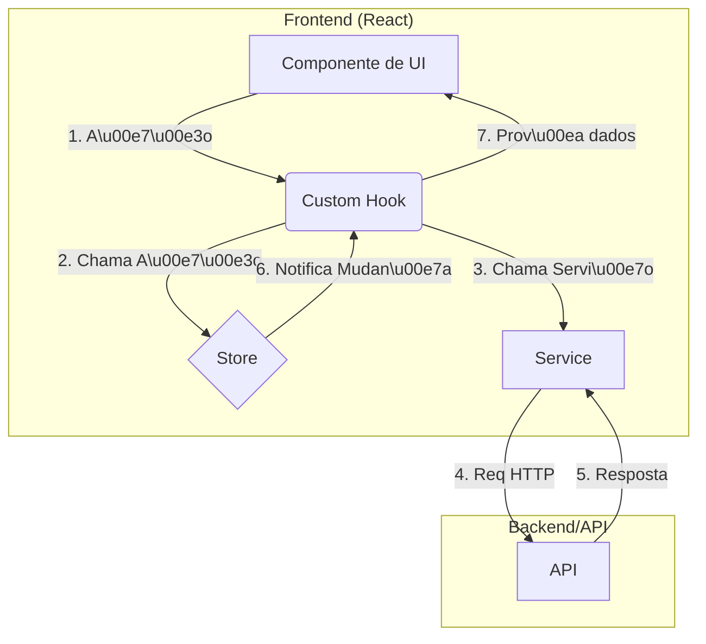

# Plataforma de Agentes - Arquitetura

## Vis\u00e3o Geral
Este documento descreve a organiza\u00e7\u00e3o do c\u00f3digo e as camadas da aplica\u00e7\u00e3o. O objetivo \u00e9 manter uma estrutura modular, previs\u00edvel e f\u00e1cil de manter.

## Stack Tecnol\u00f3gica
- **React** com **Vite**
- **TypeScript**
- **Zustand** para estado global
- **Tailwind CSS** e **shadcn/ui** para a interface
- **Vitest** e **Testing Library** para testes

## Estrutura de Pastas
```
client/src
|-- api/             # Configura\u00e7\u00f5es iniciais e cliente HTTP
|-- components/
|   |-- ui/          # Componentes visuais reutiliz\u00e1veis
|   |-- layouts/     # Componentes de layout principal
|   |-- features/    # Componentes agrupados por funcionalidade
|   |-- agents/      # Funcionalidades espec\u00edficas de agentes
|       |-- config_forms/
|-- hooks/           # L\u00f3gica de UI e efeitos colaterais
|-- services/        # Comunica\u00e7\u00e3o com APIs
|-- store/           # Zustand stores
|-- types/           # Tipagens de dom\u00ednio
|-- pages/           # Entradas de rota
|-- main.tsx         # Ponto de entrada
```

## Fluxo de Dados


## Camadas
1. **UI**: componentes e p\u00e1ginas respons\u00e1veis apenas pela renderiza\u00e7\u00e3o.
2. **Hooks**: l\u00f3gica de UI, interagem com stores e servi\u00e7os.
3. **Stores**: estado global usando Zustand.
4. **Services**: abstra\u00e7\u00e3o de comunica\u00e7\u00e3o com APIs ou mocks.

## Boas Pr\u00e1ticas
- Nunca expor credenciais no front-end; use `.env`.
- Utilizar `React.lazy` e memoiza\u00e7\u00e3o onde fizer sentido.
- Testar servi\u00e7os, hooks e componentes de forma isolada.

## Contratos e Tipos
Todos os tipos de dom\u00ednio residem em `client/src/types`. Exemplos:
```ts
export interface ChatMessage {
  id: string;
  text: string;
  sender: 'user' | 'agent' | 'system';
  timestamp: string;
}

export interface AnyAgentConfig {
  id: string;
  name: string;
  type: string;
}
```
